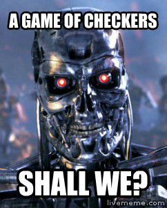

When searching for recent science accomplishment among mankind, I found out that there exist a computer checkers software that can always play a perfect game of checkers by going through all 500 billion billion possible position.

Want some challenge? You can play against it here: <a href="http://webdocs.cs.ualberta.ca/~chinook/" target="_blank" rel="noopener noreferrer">Chinook</a>

It is perfect in the sense that if you make no mistake in a game, the best you can end up with the computer is a draw. In other words, you can NEVER beat the computer.

In my opinion, this is consider a huge leap forward in artificial intelligence. This is because we still have some games that cannot be played perfectly by a computer, which includes Go(or conquer), and the ever popular chess. Thus, this success is able to bring us closer towards creating human-level artificial intelligence in computer.

Why Go and chess is different than checkers? I remember reading somewhere that says Go and chess depend on recognizing patterns, which exactly what human brain are good at. In contrast, a computer may be excellent in brute force, but significantly weak in pattern recognition when compare to human counterpart. Also, since you only move diagonally in checkers, only half of the total squares on the board are used compare to chess.

However, it’s safe to say that it’s just a matter of time before computer can beat us in those games. Hopefully by then, computers would not only score in chess, but is able to assist us in interplanetary and deep space exploration as well.

Provided that they don’t enslave us into human battery farms.