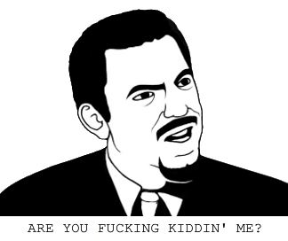
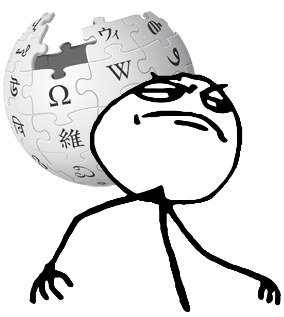

It is important to have general knowledge. I don’t realize this until when I spoke to some of my friends about things that I thought everyone should know. Can you imagine there are actually someone who don’t know who is the president of the United States? It is frustrating when you are trying to talk about something but can’t continue because the person who you are talking to apparently doesn’t know about some thing or someone?

I don’t expect you to know what’s happening between Palestine and Israel, but at least you should know the existent of these countries. It’s ok if you never read any great novels, but please at least know that the movie you just watched is really from a book. It’s fine if you don’t know the complete life story of Adolf Hitler, but please at least know that he was an important figure in WWII.

Sure, you may know how much is Kim K.’s wedding cost or the sales figure of Justin Bieber latest album. But think about it, does it matter? That will probably make some good conversation only between your circle of friends, but you can’t really bring that up when you are meeting someone new.

Some of my friends told me they can’t remember the names of people or the year of an event. Ever since the existence of Wikipedia, I’ve been looking at famous people pages to learn about their stories. Browsing Wikipedia is one of the ways to gain useful general knowledge.

Other common ways are of course from newspaper, magazines, books, television programmes, and from everyday conversation.

However, not everyone is interested in knowing more. It is either they don’t feel the need of it, or they just don’t know what they don’t know. Of course, there are also people who thinks they know enough, especially those who only read one particular book in their entire life and thought that everything they need to know is in there. Ignorant is your worst enemy.

So, what can you do about it?

The first thing you need to do is accept that you know too little. Next, you need to change your habit. Pick up a book and start reading. Spend more time on Wikipedia instead of reading your friends statuses on facebook every 5 minutes when you are online. Switch to the National Geographic channel more often instead of watching Ke$ha on MTV.

The next time when you are having a conversation with someone, you will realize you have more meaningful things to talk about rather than some celebrity boob job. You will also have more things to talk about when meeting strangers. Who knows, it might even land you your dream job or found yourself a soul partner!

