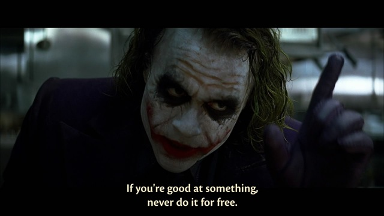

My biggest weakness is the lack of creativity.

I’m not a person who can easily come out with new ideas or can create something decent out of nothing. Although I can draw, but I’m actually good at copying. I can’t draw something from my own imagination.

Therefore, I’ve always envy and respect people who are very creative. Every time when I see some nice art work like vector art, concept design, traditional paintings, digital artwork, sculpture, cartoon and animation, etc., I’d be wondering how the hell did the person come out with such brilliant idea! To me, it’s like magic.

Although I did try to create my own art work, but it just doesn’t go well every time. My interest is there, as I used to draw since at young age, but never really good at it. When I got my first computer, I started to explore the process of creating art work using various software.

I’ve spent a good deal of time following tutorials found online for a variety of software such as Photoshop, Painter, and Lightwave 3D. In the end, nothing really turns out good. I may have learned the tools, but I’m still stuck with my lack of creativity juice.

Many years later, I still can’t create any decent art work. One of the disadvantage that I’m facing now in my job as a web programmer is that I can’t design web pages. I’ve tried spending hours trying to cough out a design that I thought was decent, but immediately getting thumbs down from my clients and colleague.

I’ve even consider going to an art school, but not sure if it will really helps, or I’m better off looking for someone else who can do the job 100x better and faster than me. Obviously, the latter seems to be a better choice. So I always say to myself: it’s better to be really good at something than to be the jack of all trade.

Hopefully, I can find someone creative to help me in my work soon.