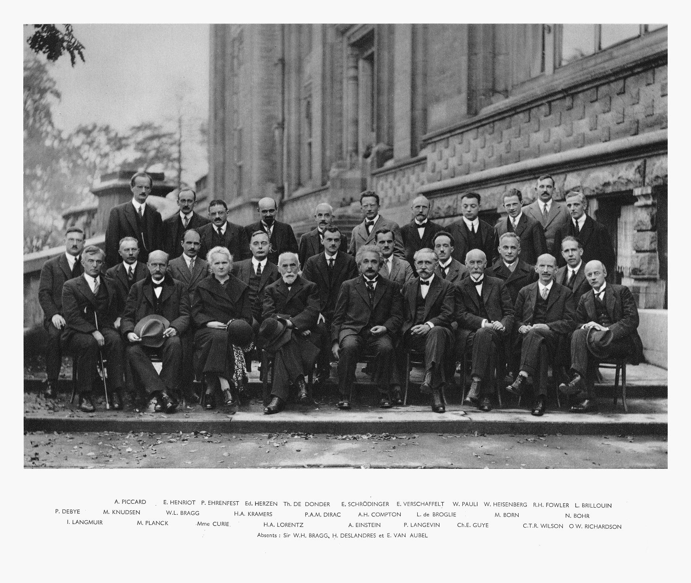
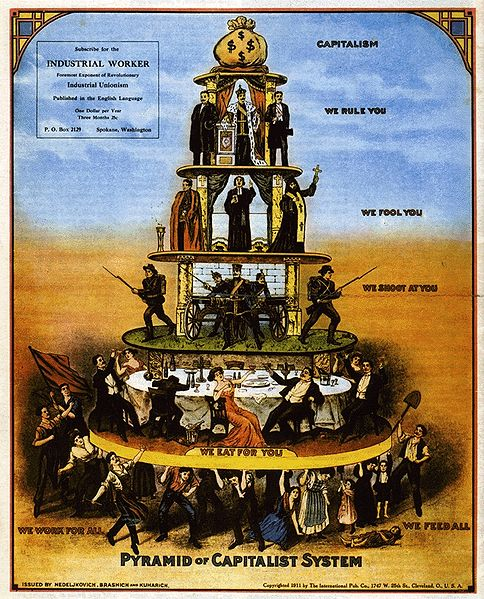
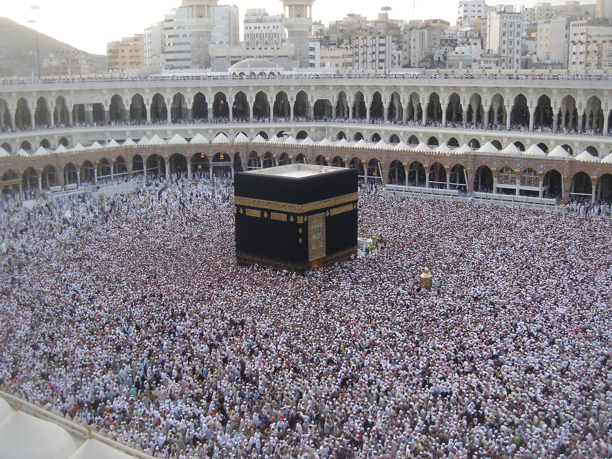
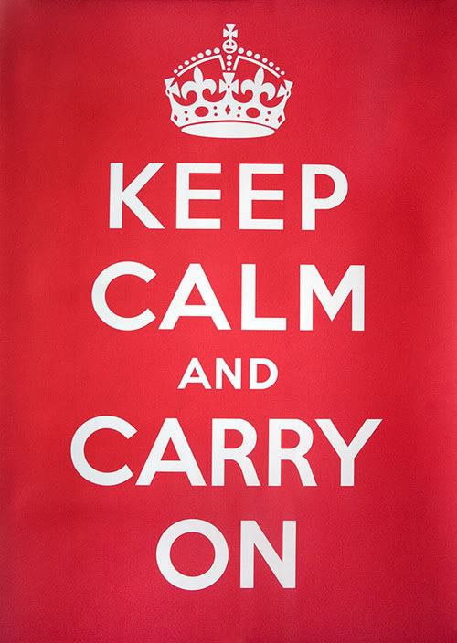

The world has 7 billion people, there must be someone who thinks the same as you.

The world has 7 billion people, how can you be sure your idea is unique?

The world has 7 billion people, what makes you think you are special?

The world has 7 billion people, you are not the one to look at.

The world has 7 billion people, you are not that important to them.

The world has 7 billion people, you are the majority.

The world has 7 billion people, if you are not running, you are losing behind.

The world has 7 billion people, what do you mean you are lonely?

The world has 7 billion people, what do you mean you can’t find a right partner?

The world has 7 billion people, there is someone waiting for you.

The world has 7 billion people, you are destined to meet some of them.

The world has 7 billion people, but not all realized that there are 7 billion others around them.

The world has 7 billion people, they have the power to destroy themselves.

The world has 7 billion people, they are very real.

The world has 7 billion people, they are very afraid now.

The world has 7 billion people, some of them are very greedy.

The world has 7 billion people, not all are sane.

The world has 7 billion people, not all are born equal.

The world has 7 billion people, not many of them are living a life as comfortably as you are.

The world has 7 billion people, not everyone cares.

The world has 7 billion people, new ones are created every second.

The world has 7 billion people, be grateful that this number is allowed to grow.

The world has 7 billion people, everyone of them are capable to love.

The world has 7 billion people, no excuse in looking for the right market for your product.

The world has 7 billion people, they are not distributed evenly.

The world has 7 billion people, our earth can easily feed them all only if resources are distributed evenly.

The world has 7 billion people, moving around efficiently is a challenge.

The world has 7 billion people, it’s getting hot in here.

The world has 7 billion people, you can’t control them like you used to.

The world has 7 billion people, you can’t depend on god anymore.

The world has 7 billion people, what do you mean you can’t find a solution?

The world has 7 billion people, we should think as a population to survive.

The world has 7 billion people, change is inevitable.

The world has 7 billion people, it’s never too late to change things.

The world has 7 billion people, it’s time to look into space.

The world has 7 billion people, it takes a while to get used to.

The world has 7 billion people, join us or die.

The world has 7 billion people, we can help each other.

The world has 7 billion people, get out and make some friends now.

The world has 7 billion people, say hi.

