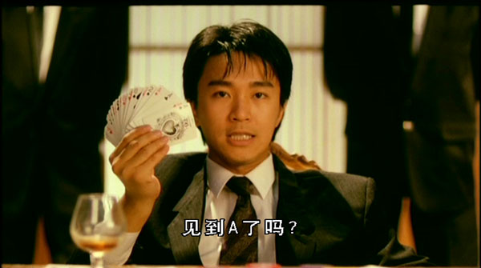

Playing cards is a common activity during the festive season. Some people claim that they are good at certain games, some blame their luck. It is also common to hear players blame their bad luck to the banker who shuffles the cards.

They really shouldn’t. Here’s why: A properly shuffled deck of cards will always produce a unique order of cards never before seen in any other game.

I found the fact from a website which explains it in detail. You can read more about it over here:

<a href="http://www.matthewweathers.com/year2006/shuffling_cards.htm" target="_blank" rel="noopener noreferrer">http://www.matthewweathers.com/year2006/shuffling_cards.htm</a>

Basically, the idea is that the total times of cards ever shuffled by human since the invention of playing cards is no way near the number of possible order of a deck card. Therefore, the chances of getting the same order of cards in a properly shuffled deck is nil.

What amazed me was that a deck of *just* 52 cards can generate such huge possible order of cards. There’s also a mathematical proof on the site if you are interested in the math.

Still trying your luck? Well, as they say, the odds are there.

