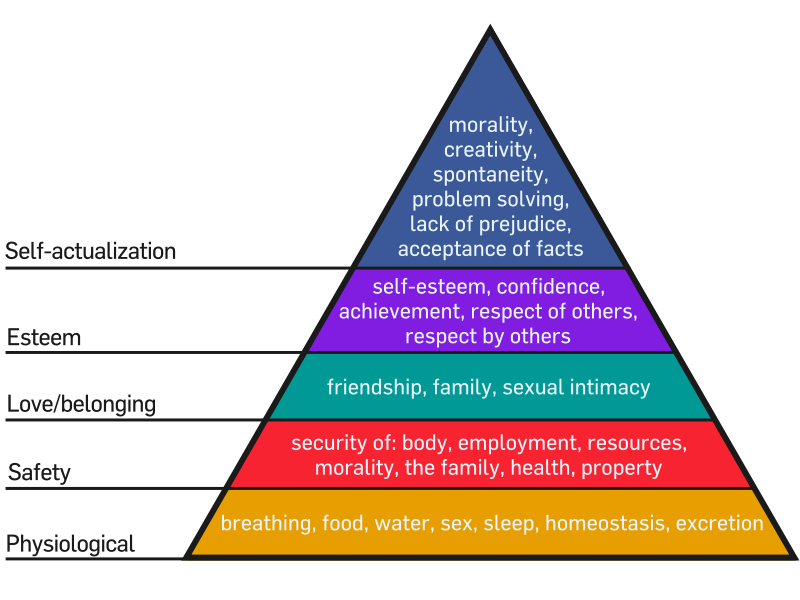
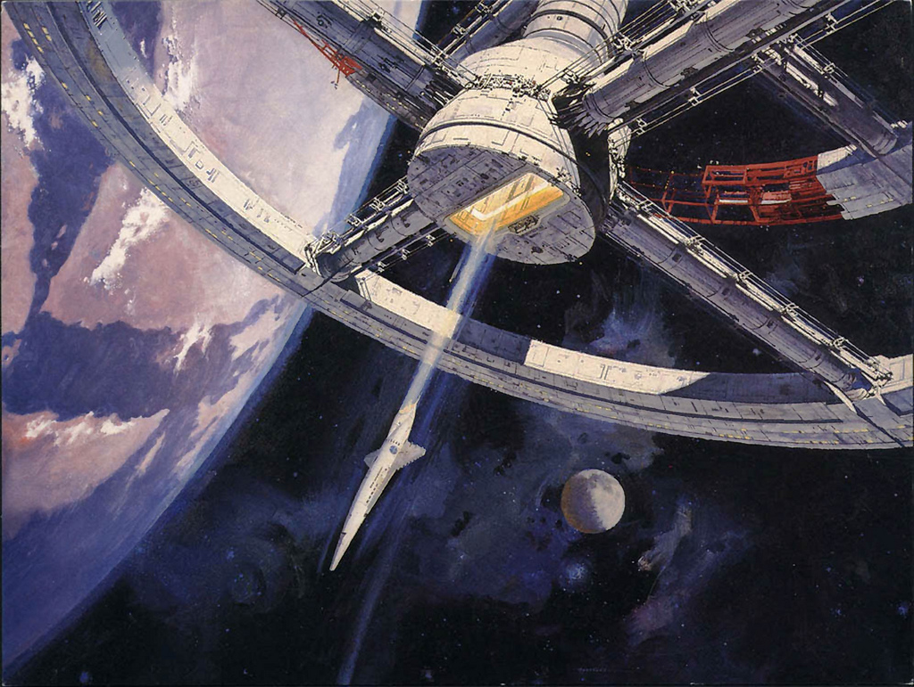

Think about it, we go to work because we want to survive and be able to live in the system. The reward(money) we gain from putting our time in a work will enable us to buy food, that fulfills our physiological need. The food that we consume came a long way from the farm. Energy is needed to grow, harvest, and transport the food to us. Therefore, we are really paying for the effort(energy) to get the food. And right now, most energy comes from fossil fuels under the earth. Price of food is rising noticeably because fossil fuels is a limited source of energy. When something is limited, the value becomes high.

Therefore, if we have access to unlimited supply of energy, the price will definitely go down because there’s plenty of it for everyone. Heck, it will be so low that it will be free.

According to <a href="https://en.wikipedia.org/wiki/Maslow's_hierarchy_of_needs" target="_blank" rel="noopener noreferrer">Maslow’s hierarchy of needs</a>, human must reach a certain level of security in life before moving up to the higher level to focus on some other things. Here are some simple examples: A construction worker must eat before he has energy to start work. A student must also eat before he is able to concentrate in class or homework. A writer will not able to write in hunger.

So, when we we don’t have to worry about fulfilling our daily needs, we can start to focus on other things. Particularly things that humans are good at, such as science, art, literature, and other intellectual activity that benefits the human race.

Is there such thing as unlimited supply of energy?

Let’s try to put this situation according to what we know now. One of the way is to extract the heat from our earth mantle. Iceland has already done that very well, with 80% of their total energy consumption comes from geothermal. But right now, not all location in the world is suitable for geothermal with the current technology we have. Nuclear fusion is another way but we are still far from perfecting it to fit into the grid. Another way is to extract the energy from the sun. But right now we have yet to find a cheap and efficient method to extract energy from it.

Let’s imagine that in the near future, we had the technology to drill deep enough anywhere we wanted to extract the heat from our earth core, and nuclear fusion is finally feeding power to the grid, plus a breakthrough in material science that enable us to produce cheap and highly efficient solar panels easily.

From then on, the world will be very different as we know it.

Imagine a world where there exist a virtually infinite supply of energy. That we can use to power our automobiles, electrical appliances, gadgets, and our entire house. That the city can use it to power the street lights, transportation network, and all public facilities. That the farm can use it to power the machine to grow crops, feed cattle, and harvest the yield. That the factories can use it to process food, manufacture machines, produce goods, and recycle our waste. That the nation can use it to power universities, research labs, and build infrastructures for its people.

All that, without worrying the source of energy will ever run out. And without having to pay a single cent ever.

When energy is free, most of the tangible product in the market will be free too.

Since resources are plenty now, there will be no more war and tension between the world’s superpower nations. 3rd world countries are able to thrive and compete with the 1st world countries.

Every human race will now focus on expanding knowledge and learn about themselves and the universe. Soon, we will progress into a completely new era with speed unmatched in any point in the human history.

That’s what I always dreamt of the future. To me, that is utopia.

