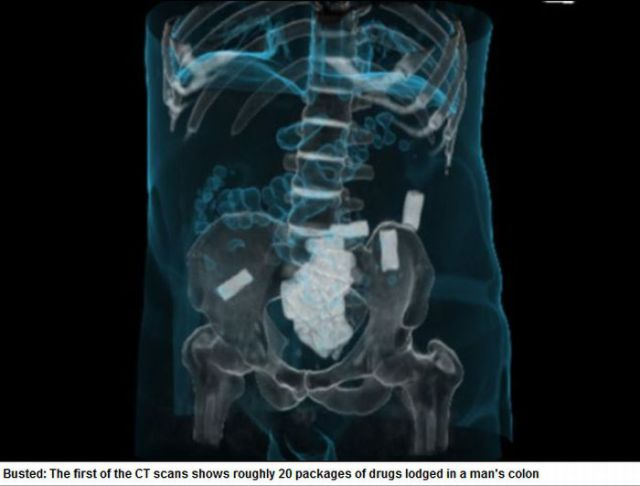
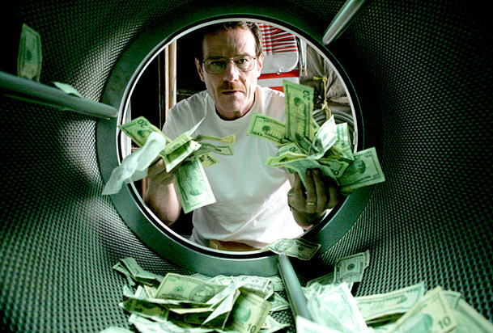

Sometimes I like to imagine I’m a policeman working in the narcotics department that bust drug rings by using state of the art equipment. I don’t remember when I started to have this fantasy but the idea was definitely came from tv shows.

I’m pretty interested in everything that is related to illegal drugs. From the types of drugs, origin, distribution, uses, cartels, victims, price, war, agencies, and their operations. The fight against illegal drug trade and drug abuse will never end anytime soon. Therefore, of all the activities I just mentioned, anyone can choose to be a grower or manufacturer, a small time seller, a big time distributor, an enforcement agency, a spy or sting, a researcher, or a regular user.

For me, I’ll choose to be an enforcement agency that fight against those who produce and distribute illegal drugs and protect those potential victims and their family members. Particularly, I would like to be responsible for the intelligence part where my job is to gather and process information that can lead to the capture or “busting” of a drug ring.

Needless to say, I’m a big fan of crime genre movies and tv shows. Whenever I watched these shows, I’ll always keep in mind that “it’s not so simple”. No matter how close the show portrays it, it is always not the whole picture. In the real drug world, people suffer and die for real. There’re are no heroes or 1 man show. In the real world, the enforcement work as a team.

In the country that I live in, drug trafficking is a death sentence. Occasionally, we can see successful drug busting operation carried out by police. The media only reports the outcome, but the public will never know the amount of time, effort, and sometimes lives that has been put in to just bust 1 single operation. Not to mention the failed ones.

I’ve even at some point in life considered the option of joining the law enforcement force. But I’ve never seriously look into the recruitment process.

Aside from risk, I think the job is pretty fun. I’ll get to plant bugs in enemy quarters and listen from a mobile station not far away and ready to give order to strike. Another aspect is to look into bank’s and business record for illicit transaction and potential money laundering activities. I could also be working with stings, where they are the most dangerous job in the whole operation.

After collecting the information, we must also never assume all information are accurate. Sometimes, the enemy may be smarter than we think. The worse that false information can cause is just wasted time. However, false information can also be a trap too. It is important to never assume anything.

Besides gathering information, I think protecting them is equally important. What stops the enemy to plant bug or sting among us? I’ll not be surprised if mole is a common thing that exist among the law enforcement forces. Even after a successful drug raid, all the information shall remain classified as the enemy might use it to get smarter.

In the end, the winner in this battle will be the party that has the most information.

