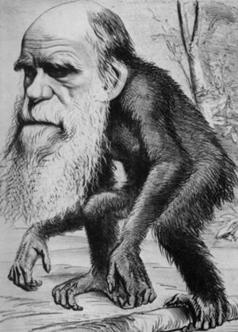
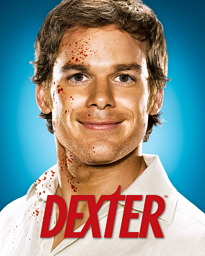
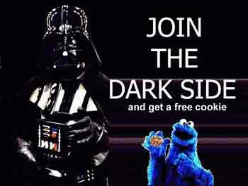

If you believe in evolution, you know that we humans evolved from mammals. While most mammals has fur and body hair, this actually makes us the ugliest mammals among all. No? Just imagine your dog or cat without fur.

But luckily, we are blessed with intelligence and often consider our self as the upper rule of all other living things on earth. Therefore, being hair-naked seems to be unique.

When properly trained, animals can show intelligence too. What really separate us from them is our fully developed senses and flexible limbs. Without them, we’d look like a dolphin trying to build a fort, or a monkey screaming senselessly for food.

The nature is a game of ‘survivor of the fittest’. This can’t be true enough and can be observed on all living things on earth, whether in a pack or individually, including us humans. However, the difference is that we are intelligent enough to hide our ‘true nature’. While some animals can disguise themselves, but they will still kill whenever there’s a chance, disregard if their kinds are around or not.

You dress up when you are outside, and you know how to act and react in public. In contrast, of course, an animal cannot possibly care much about their action and consequences. The only time when we couldn’t care less about our appearance is when we are all alone by our self.

When a person is alone, he is more likely to be the real self. If we study closely, we actually tend to be more like an animal. For example, we don’t dress up or make up when we are not seeing anyone, and we will use our bare hand to eat instead of a fork.

Apart from that, being alone also provide a chance for some people to do certain activities that the society deem inappropriate or out of the norm.  This is what I prefer to call the dark side. The dark side can sometimes be a crime or morally wrong.

Some people like collecting weird item like their pet feces, fingernails, hair, old dolls, used diapers, and do god knows what with them. Some people like to do things on other people like stalking, frightening, torturing, demon rituals, sex fetishes, kidnapping, raping, killing, and the list goes on. Some like to write or draw explicit content. Some will do stuff to their body like self-inflicting harm, dress as opposite sex or other creature, like a cow or something, shower their bodies with food or other stuff. Some just uses their imagination like talking to themself, imagining impossible scenario, planning murders, having an imaginary friend, or thinks he is a god or messiah and everyone else doesn’t matter.

Don’t be surprised, but the more extreme ones will mostly occur in wealthy and well to do upper class society. When you have the money, you can almost do anything to anything or anyone and no one will know nothing about it. People without such economy power will tend to settle on less extreme stuff such as item collecting.

The question is, why? Why they have to do it? The reason is simple. Why do you scratch your feet? Because it’s itchy and scratching makes it feels good. People do it is because they can get a ‘kick’ from it. When they are doing it, they suddenly have a sense of uniqueness, they feel special among their kind. People like to feel special and selected. In short, people enjoy to be in the dark side.

I believe every single person has their dark side. I have one too, but I’m not telling you because it has no value to be gained from it, and I think the society might think it is crazy or inappropriate. If you know someone that appears to be very innocent, or just doesn’t ‘fit in’, believe me, they are not who you think they are. Even if they don’t show it, it is somewhere in their head.

Think about it, up til today there’s still no one who knows about your dark side, so what makes you think you will know other person’s if they have one? The fact is, you will probably never know in your entire life. Even if you think you are very close to that person, they are not going to like just invite you to their dark side.

If you don’t agree, or you don’t think you have a dark side, convince me. The comment is open for you.

Welcome to the dark side, you are not alone.

