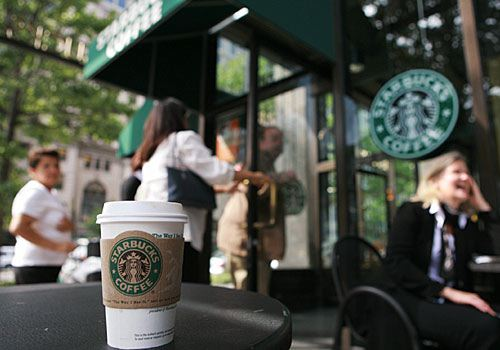
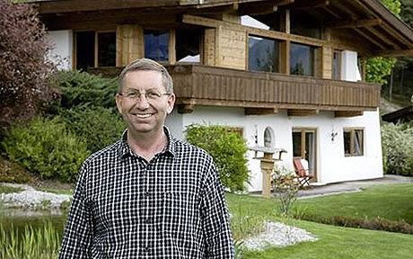

I noticed that people are becoming more and more materialistic. You will only appear successful if you drives a luxury car, uses the latest smart phone, and appearing frequently at expensive bars and café.

The sole purpose in social life seems to be just showing off among your peers. This causes less successful people to hate the ones that has the wealth to show off. But when they become successful themself, they will very likely to show off too.

In the end of the day, I don’t think they will ever find happiness in it.

Recently, there’s a millionaire who just cannot find happiness in his perfect life decided to donate all his wealth and lives in a small hut on a hill. <a href="https://www.telegraph.co.uk/news/worldnews/europe/austria/7190750/Millionaire-gives-away-fortune-that-made-him-miserable.html" target="_blank" rel="noopener noreferrer">Karl Rabeder</a>, 49, uses all the donated funds to setup a non-profit organization that gives out micro-loan to small business owners in rural countries. Apparently his wife left him the moment he made the life changing decision. But he is now a happy man.

You can make people do great things if there is money as a reward. However, great things happen when money isn’t the prime motivation. The recent example is Instagram, who recently acquired by facebook for $1 billion. Their app is free to download.

So, I think we should not be blinded by money in any situation. But at the same time, we should reward and compensate people well who have truly put in their effort in the things they do.