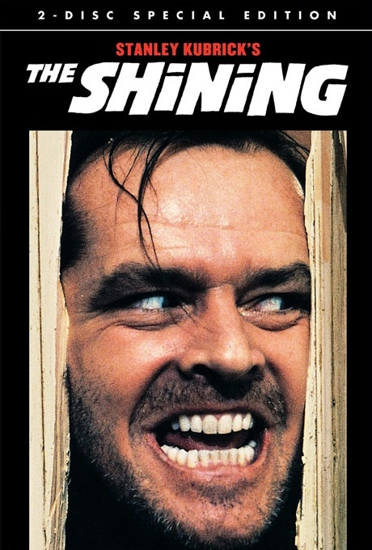
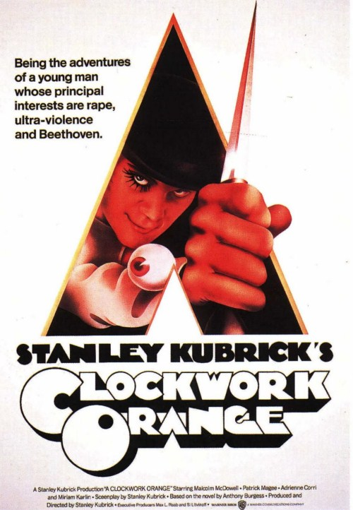

1. Tonight I’m going to talk about one my good friend, Alvin.

2. I met him during my high school year. He is a mix Chinese Indian and his family is very wealthy. He lives in a 4-storey bungalow on top of a hill. There’s a badminton court and a similar size swimming pool behind his backyard. Beside the court there’s another 2-storey building that was meant to be a small apartment-like house built for his sister upon her marriage.

3. After his sister moved out to her new place, the apartment becomes vacant. So my friend decided to build a home cinema on the first floor. The ground floor is actually open and used for parking cars. Occasionally he would invite me to watch movies at his home cinema.

4. The hill area that he lives is surrounded by many low-cost apartments that his family once lived. They moved up to the hill and bought the land to build a bungalow after his father made a fortune in the business. Albeit their new life style, neither he or his siblings are rich spoilt brats. Their family is a strict catholic family that goes to church every weekends. The best part is he doesn’t even had a television set in their house. All he have during growing up are books. I would say that’s very good parenting there. Due to that, he and each of his siblings has grown up to become a smart and wonderful person.

5. During my schooling years, I’ve never met anyone in school who really knows a lot of geeky stuff. Things changed when he came to my school for 2 years of high school. Everyday at school we would exchange about knowledge that we know and talk about them endlessly. Usually the conversation also joined by other friends. When I got home after school, I would go on to the internet and wikipedia out whatever topic that I managed to dive into. And then the next day I would talk about it with him.

6. Most of the time, however, he is the one who always knows more. The reason is simple: he reads more than everyone in our class combined. He just seems to know stuff. So, I really enjoyed having him as a friend, as we both understand each other pretty well.

7. After high school, we managed to went in to the same University but different faculties. Since then, we are both busy for our own matters and seldom make time to meet up. If I can remember, we only went for lunch together once during our 4 years in University.

8. After graduation, we started to meet more often for outings and drinks. We resumed our golden age and talk about everything and anything. It is also from him that I started to appreciate the cinemas and good movies. I don’t just opt for the latest box office, but would always look for the classics and also starting to recognize famous actors, actresses, and even directors.

9. However, things change and people move on. One year after graduation, he decided to further his study overseas. Since then, I have temporary lost a friend that can talk about stuff we each understands. At the same time, my business is starting to requires extra attention. Due both reasons, I have cut down on movies significantly too.

10. But that is alright. While he is studying abroad now, I will be focusing on growing my business. The next time we meet, we will both be at a different higher level. Although we may not know what the future might hold for us, but what I can say is I will always have a friend that I truely enjoy spending time with.