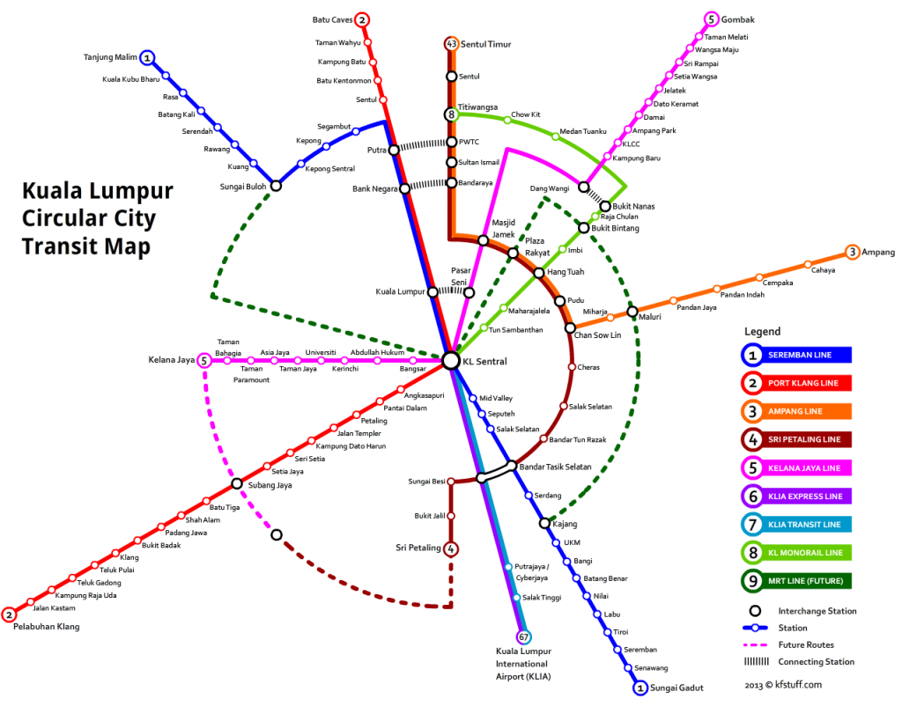

Inspired by <a href="http://privatewww.essex.ac.uk/~mjr/underground/circles/gallery/Circles_Maps.html" target="_blank" rel="noopener noreferrer">privatewww.essex.ac.uk/~mjr/underground/circles/gallery/Circles_Maps.html</a>, I have created a circular map version of our very own city Kuala Lumpur.

While creating the map, I felt very excited for the entire process. Partly because it took me off of my daily work routine, allowing me to actually do my own stuff, without having to think about deliverables.

Another reason is due to my long time absent from involving in personal projects. This map may be a small project, but it certainly fills my inner geek.

Up to now, I’m not sure I should continue to rant about my work & personal stuff, or actually talk more about the process of creating the circular map.

Sometimes, we should stop chasing the never ending schedule, and actually spend some time to do the things that we always wanted to do. This is one way to let your inner self to get your attention, to remind you that you need to be more “you”.

#### The Map

It took me 4 days on & off and 6 iterations to get to the final form you see above. 4 on paper, and 2 in digital.

While doing research, I finally gave a deeper look into the complete route of all 8 major rail lines in the city, plus the upcoming LRT extension line and MRT line. It seems they finally “leave no loose ends” in the routes and go full circle.

What surprises me most is how everything fits quite well together in the circular map form, with every turns & interchanges getting into positions that are just right.

I also tried to make the locations of each end terminal points to the correct direction where one can expect while looking at an actual map.

That’s all for tonight. Enjoy the map and feel free to leave your comment below.