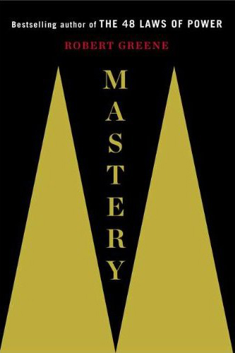

Recently, I came upon the realisation that I have perhaps spent too much time on my current comfort level without any significant change or improvement. After much searching and talking, I had managed to find the root cause of the problem and am now working towards on steering myself to the right path.

This all started when I noticed my recent freelance business income had started to show signs of steadiness at a comfortable level. This is my 2nd serious income and 1st successful venture that has been going well.

But the steadiness also means nothing exciting has happen. I realised what I have been doing now has essentially no major difference from when I just started out. It is change that I need, but not fully aware of it.

Until one day, a good friend of mine came to my place and we had a little chat. A little background of him first. He’s an engineer and has been performing very well in his firm, receiving praise from both his superiors and clients. Apart from his job, he is also an active property investor, and is doing quite well in it too.

However, on that day, he told me that he realised what he has been doing is not sustainable and he does not see the future that he wanted. It looks like he is having the same “steadiness” problem as me. But better yet, he had found a way to change this. He says he is hoping to fine tune himself and to look into other fields and opportunities that will able to take him where he wants to be exactly.

After he left, the idea of fine tuning keep lingering in my head. And so, I turned to Google and start searching for answers, as if there’s one for me.

Initial search brings me to some of the popular self-help blogs. I spent time to read through some of them, and also found some interview videos conducted by the author of the blog with some entrepreneurs. In the interview, they recommended some books to read that will take you to a higher level, which is what I’m looking for.

And that’s how I discover a book that has all the answers to the questions that aris from the current stage of my life.

The book, Mastery, by Robert Greene, which I had also used it as the title of this post.

Mastery have all the answers to what I am looking for. It basically convey the idea that everyone should discover their life task and attain mastery in the career they choose by means of apprenticeship. Attaining mastery is the ultimate goal and the highest form of intelligence reachable by a person.

As I reading through the book, everything seems to fit in so nicely with my thinking. What it also delivers is the structure and clear steps for one to attain mastery in ones chosen field or career, which is often a fuzzy path for most people. Some people know they need or wanted to be the best in their field, but they just don’t know how. Robert Greene is able to organize the ideas and steps required to attain mastery that span across well structured chapters in his book.

Reading the book is almost like finding the path of enlightenment to for my mind.

I have since spoken to quite a number of people around me about the ideas from the book. What I realised is, not surprisingly, everyone that I talked to totally isn’t ready or haven’t even thought about it before. However, it addresses exactly the main social problem that most people face in today’s material-based, consumer society. For example:

1. Why do people feel empty or hollow in their life even though they have everything they wanted?

2. Why do young people keep hopping jobs and never seems to be able to settle in a career?

3. Why most people are unhappy with their life?

The following interview with the author, Robert Greene, has some answers for the above questions.

https://youtu.be/8sYmQFPXmJA

I believe that the term “hobby” has been understated of its true meaning. When you talk about hobby, people tend to think that hobby is a thing for kids, or something that adults do when they have extra time to spare, that generally doesn’t bring any real value to ones career or to the society at large.

However, the main reason people are feeling uncontented in their life because of lack of a hobby to pursue. In the book Master, Robert Greene also called it as a “life-task”. As human being, we have to be kept busy. Or else, we will feel uneasy and frustrated. If prolonged and not being addressed, it will lead to more serious problem such as depression.

It’s very interesting to observe the response that I get from people whenever I talked to them about the idea of mastery and the problems it can solved. It made me realised how clueless many people can be when it comes to their own destiny. It is conformity to be blamed, and people’s opinion does matter it seems.

I highly recommend Mastery to anyone who wishes to have a more fulfillment life. Only when one pursue his or her life task and attain mastery that he or she can be said to have really lived.

Although I have yet to discover what is my life task is, but I do believe I am very close in discovering it. At least now I know what direction I am supposed to be heading(where), and what I need to do next(what) and for how long(when). After determining my life task, the next step should be finding the appropriate apprenticeship(who), and the means of attaining mastery(how).

Or perhaps, only by taking action, that I will be discovering it during the process of doing.

Good luck!