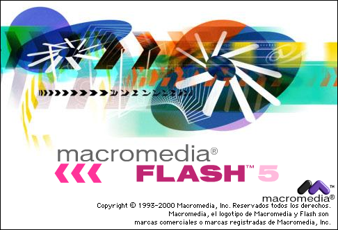
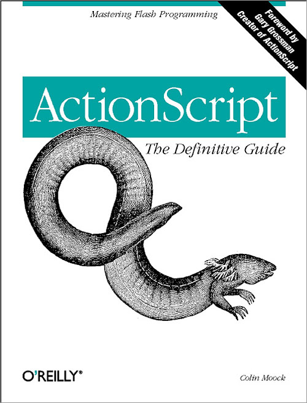

Recently when I’m going through the tutorials of iOS8 using Xcode, it really reminds me of the Flash days. Yes, that Adobe/Macromedia Flash.

Can’t even find an English screenshot

It was 2001+ when I discovered Flash & immediately fall in love with it. The multimedia capabilities was unprecedented at that time. It made creating games & animations possible for everyone with simple tools.

I even bought my first programming book to learn ActionScript. It is almost 700 pages but I managed to read it from cover to cover! I would then print out the full documentation of ActionScript & studied it thoroughly.

I’m so glad I did, as it has helped me built my foundation in programming.

I hope I can master Xcode & iOS App programming like how I used to mastered Flash almost 10+ years ago.