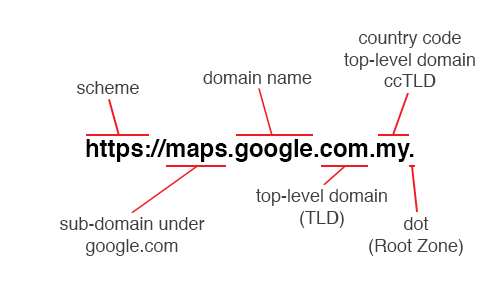

What if the structure of the current domain name were reversed?

Current domain name: `maps.google.com.my`
Reversed domain name: `my.com.google.maps` (looks familiar?)

We all know that in UNIX system, file hierarchy starts with the root (`/`) and followed by sub-directories. An example would be `/home/user/web/images/cat.jpg`

So why not the same rule applies to domain name as well? Before we go any deeper, let’s understand the components of a fully qualified domain name.



We will talk a little bit about the first part of the URL, which is the scheme that is used to determine the protocol of the request. In the above example, https is translated into HyperText Transfer Protocol Secure. The colon indicates the end of the scheme, and the double forward-slashes separates the scheme with the rest of the URL.

Moving forward, the rest of the URL shouldn’t be too foreign to everyday users, as it is usually the first thing you type into the address bar in your browser.

Now, I believe something must have caught your attention right at the end of the URL. The trailing dot. The dot represents the root zone of the DNS and it’s usually omitted in everyday use but it is there in every request that you make.


So as you can see from the DNS(Domain Name System) hierarchy diagram above, wouldn’t it be more logical to have the domain name structure to start from the top with the root, instead of ending with it? Let’s see some examples:

Without sub-domain:

```
com.google/search
com.yahoo/weather
com.facebook/profile.php
com.uber/register
com.amazon/shipping
co.hotel/bookings
co.stripe/pay
```

With sub-domain:

```
com.google.maps/search
com.google.mail/inbox
org.wikipedia.en/wiki/URL
org.wikipedia.cn/wiki/China
```

Country code TLDs:

```
uk.co.churchill/history.html
jp.tokyo2020/medals
my.nike/new
my.ikea/bathroom
my.cafe/menu.html
my.taxi/book
my.com.google.maps
```

In the last example, I have previously mentioned that it might looked familiar to some of you. Back in the early days of the internet, there is something called Usenet where early users logged on to meet other users in different channels called newsgroup, organized by different categories and interest. For example:

`comp.lang.c`

which is an interest group for the C programming language within the Computer Science community.

Other examples include:

```
comp.os.linux
comp.os.windows
sci.math
alt.binaries.mp3
```

..and many more.

As you can see, the naming follows a clear hierarchy where one can expect to find when they read from left to right, as they zoom into specific topic of interest.

So, why not domain name be like that too? Isn’t such naming structure where one travels from the top of the root, and as you travel down the hierarchy with each separating dot, zooming in to a more specific domain, and finally reaching your destination server, actually makes more sense and logical?

Let’s imagine a scenario where you are looking for a piece of furniture from ikea in your country, say, Malaysia. So you know where you want to go, you start with the country code, which in this case, `.my`, and followed by the organization domain name, which is ikea. By now, you would have `.my.ikea`(if you remember the dot that represents the root zone is optional). And then you would like the content to be presented in English, so you added the sub-domain, `.en`. There. You have reached your destination by means of deduction: `.my.ikea.en`

Now, that piece of furniture is a bar stool, and it should be in the kitchen department. And as like before, you start from the department and slowly zoom in to the specific product: `.my.ikea.en/kitchen/dining/barstool/ingolf`

As you may have recognized, the later part of the domain after the domain name is nothing new. We have already been doing this following the file system hierarchy of our computer.

And best of all, no more awkward placement of Malaysia’s country code `.my` at the end of the domain name, which usually doesn’t sound quite right when pronounced. `my.mrt` definitely look and sound way more natural then `mrt.my`, don’t you think?