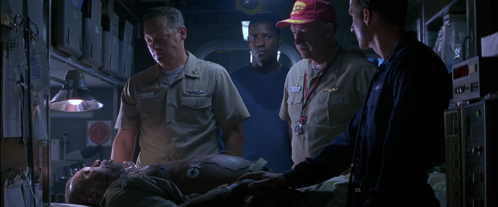
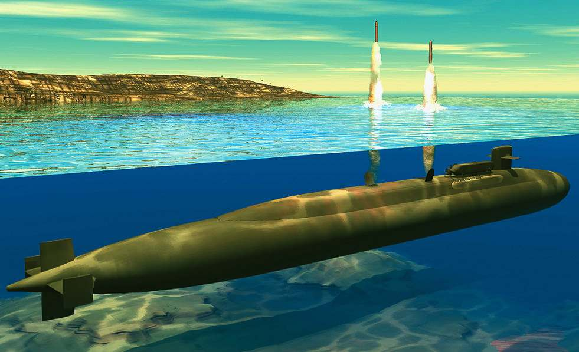
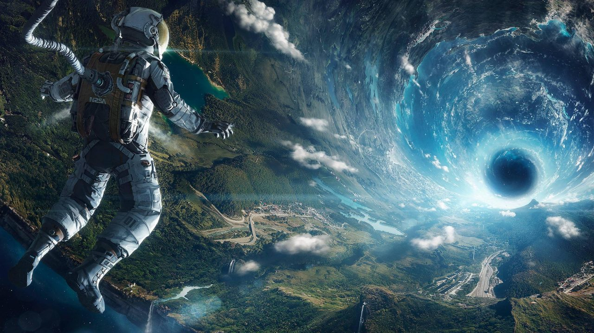

I was watching yet another excellent performance by Denzel Washington(I know, I know, let’s hold the debate for another time) in <a href="https://www.imdb.com/title/tt0112740/" target="_blank" rel="noopener noreferrer">Crimson Tide (1995)</a>, and while half-way through the movie, I realised something very wrong yet profoundly true situation:

Humans are very inefficient in operating mechanical machineries.

In the movie, Denzel and crew were onboard the U.S.S Alabama nuclear submarine enroute to the Sea of Japan waters, in response to a potential nuclear threat by Russian rebels who took control of one of the Russian ICBMs.

Around day 2 of their journey, there was a fire broken out from what it appears to be the kitchen area. Although the Navy has proper procedures to handle all kinds of situations, including fire on board, but most of the crew appears to be somewhat in panic situation. The only person cool-headed enough to handle the situation and eventually saved the day would nonetheless be our hero – Denzel.

And at this moment, the captain (played by Gene Hackman) decided to perform a missile drill, with the reason of while at war, everything will go wrong. And this is the best time to perform a drill while there’s another simultaneous situation going on.

Just when Denzel done putting out the fire, he heard the drill from the announcement. As the Executive Commander, he had to rushed back to control centre to be part of the missile drill process. Now, even our cool-headed Denzel wasn’t calm anymore, and was not in a best state of performing the missile drill. Noticeable panting and delay in his speech was observed.

Keep in mind that while all these were happening, the rest of the crew on board were dashing up and down between putting out the fire and running checks to perform the missile drill. Furthermore, there were also emotions involved as tension built up between Denzel and the captain on the latter’s decision making.

And it was at this very moment that I realised there’s just too much room for error when the task of delivering and launching nuclear missile from a sub is left to humans to handle.

Just imagine for a second, what if the task is left to computers instead? An autonomous nuclear submarine roaming underneath the ocean indefinitely, without the need to resurface for supplies.

First of all, there probably won’t be a fire if there’s no kitchen in the sub. No kitchen means no cooking with fire. And there wouldn’t be the need for Denzel to run from the kitchen to the command centre if the launch was handled by the computer alone. There might not even be a passageway if there’s no human.

All control and operations of the submarine will be controlled by an actual command centre from the Pentagon via satellite, where the autorization of performing critical actions such as the launching of nuclear missiles will be centralized with clarity and certainty.

Moreover, the sub can be made much, much smaller, by eliminating many sections that were essential for housing a human crew, such as the cabin, food storage room, toilets and bathrooms, dining area, pantry, kitchen, the rec room if there’s one, and not to mention chair spaces in front of the computers in the control room. I’m seeing at least 50% space saving, which can be put to other uses such as maximizing the fuel content, or housing a larger, more powerful propulsion system.

And in the event if the sub is involved in a torpedo situation(it did happened in the movie) with another sub and was unfortunately destroyed, no human life will be lost. Heck, the sub could even go kamikaze in the event where there’s no chances of surviving in a battle.

Of course, I’m aware that there are certain things humans are still better than computers, such as intuition and reasoning. I was about to say pattern recognition and decision making but this may not be true anymore due to the recent advancement in Artificial Intelligence, Deep Learning, and Neural Network showcased by some of the big corporations in the tech sector.

When this is applied to space exploration where unmanned, fully-automated vessels were sent out to space, curiosity might also be a valid reason to send humans to such space expeditions. But apart from that, if the mission or objective of the operation is to perform monitoring or patrolling, resource or data gathering, and other repetitive work, it is best left to computers for optimum efficiency and competence that will ensure reliability and responsiveness.

And we humans should be best left with the task of discovering and solving problems, making sense of data and information, and innovate through creativity and intuition.